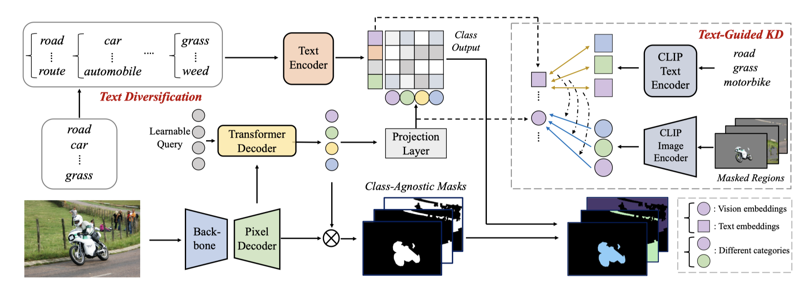
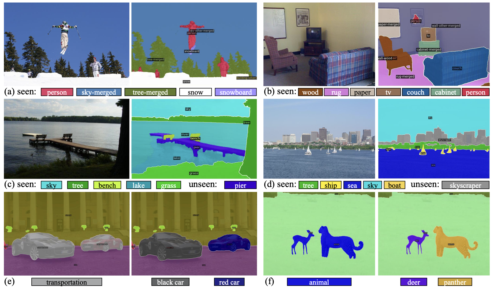
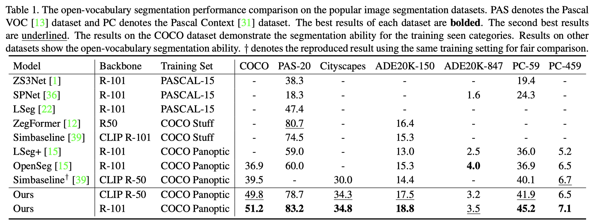

# Global Knowledge Calibration for Fast Open-Vocabulary Segmentation
Kunyang Han*, Yong Liu*, Jun Hao Liew, Henghui Ding, Yunchao Wei, Jiajun Liu, Yitong Wang, Yansong Tang, Yujiu Yang, Jiashi Feng, Yao Zhao
(*equal contribution)

The repository contains the official implementation of "Global Knowledge Calibration for Fast Open-Vocabulary Segmentation"

[Paper](https://openaccess.thecvf.com/content/ICCV2023/papers/Han_Global_Knowledge_Calibration_for_Fast_Open-Vocabulary_Segmentation_ICCV_2023_paper.pdf)

 

## 📖 Abstract
Recent advancements in pre-trained vision-language models, such as CLIP, have enabled the segmentation of arbitrary concepts solely from textual inputs, a process commonly referred to as open-vocabulary semantic segmentation (OVS). However, existing OVS techniques confront a fundamental challenge: the trained classifier tends to overfit on the base classes observed during training, resulting in suboptimal generalization performance to unseen classes. To mitigate this issue, recent studies have proposed the use of an additional frozen pre-trained CLIP for classification. Nonetheless, this approach incurs heavy computational overheads as the CLIP vision encoder must be repeatedly forward-passed for each mask, rendering it impractical for real-world applications. To address this challenge, our objective is to develop a fast OVS model that can perform comparably or better without the extra computational burden of the CLIP image encoder during inference. To this end, we propose a core idea of preserving the generalizable representation when fine-tuning on known classes. Specifically, we introduce a text diversification strategy that generates a set of synonyms for each training category, which prevents the learned representation from collapsing onto specific known category names. Additionally, we employ a textguided knowledge distillation method to preserve the generalizable knowledge of CLIP. Extensive experiments demonstrate that our proposed model achieves robust generalization performance across various datasets. Furthermore, we perform a preliminary exploration of open-vocabulary video segmentation and present a benchmark that can facilitate future open-vocabulary research in the video domain.

---
## 📖 Pipeline

 

## 📖 Visualization

 

## 📖 Results

 

## 🎤🎤🎤 Todo

- [ ] Release the data preparation process and pretrained checkpoint